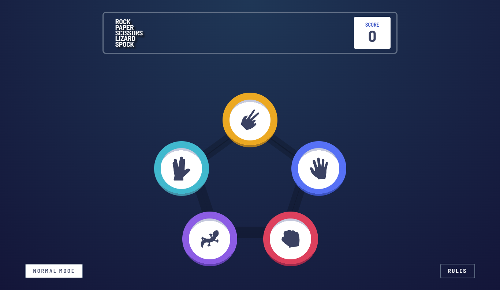

# Frontend Mentor - Rock, Paper, Scissors Challenge

This is a solution to the [Rock, Paper, Scissors challenge on Frontend Mentor](https://www.frontendmentor.io/challenges/rock-paper-scissors-game-pTgwgvgH/). Frontend Mentor challenges help you improve your coding skills by building realistic projects.

## Table of contents

- [Overview](#overview)
  - [Screenshot](#screenshot)
  - [Links](#links)
- [My process](#my-process)
  - [Built with](#built-with)
  - [What I learned](#what-i-learned)
- [Author](#author)

## Overview

### Screenshot

### Links

- Solution URL: [Github](https://github.com/EcePJD/frontendMentor_rockPaperScissors)
- Live Site URL: [Github.io](https://ecepjd.github.io/frontendMentor_rockPaperScissors/)

## My process
The first thing that I did was to add my custom footer. Then I made a draft html layout based on the design specification given. Next I commented out the draft html and created a prototype game where instead of cool icons, its just an input field. The purpose of the prototype is to check if the script I made strictly follows the conditions indicated in the rules modal.

### Built with
- Semantic HTML5 markup
- CSS custom properties
- Mobile-first workflow
- Javascript

### What I learned

## Author

- Github - [@EcePJD](https://github.com/EcePJD)
- Frontend Mentor - [@EcePJD](https://www.frontendmentor.io/profile/EcePJD)
- Facebook - [@ECEPJDeLeon](https://www.facebook.com/ECEPJDeLeon)