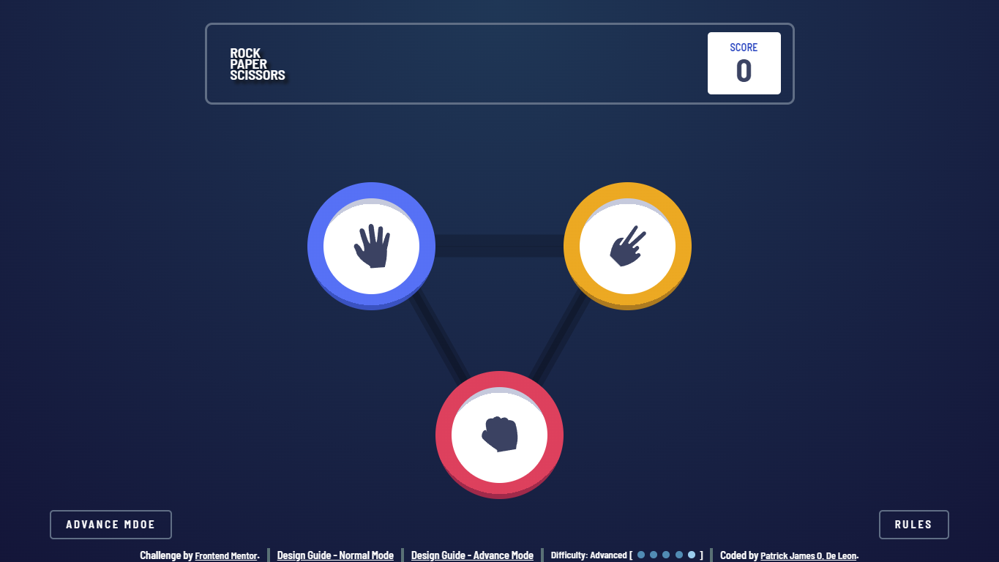

# Frontend Mentor - Rock, Paper, Scissors Challenge

This is a solution to the [Rock, Paper, Scissors challenge on Frontend Mentor](https://www.frontendmentor.io/challenges/rock-paper-scissors-game-pTgwgvgH/). Frontend Mentor challenges help you improve your coding skills by building realistic projects.

## Table of contents

- [Overview](#overview)
  - [Screenshot](#screenshot)
  - [Links](#links)
- [My process](#my-process)
  - [Built with](#built-with)
  - [What I learned](#what-i-learned)
- [Author](#author)

## Overview

### Screenshot

### Links

- Solution URL: [Github](https://github.com/EcePJD/frontendMentor_rockPaperScissors)
- Live Site URL: [Github.io](https://ecepjd.github.io/frontendMentor_rockPaperScissors/)

## My process
My goal in here is to create the game by only using vanilla CSS and Javascript as a refresher for me. The first thing I did was to create the html structure following some of the propper semantic standards on html. The next thing I did was apply CSS attributess to make it identical to the specification given with the challenge. After those, I started creating a prototype of the game to create and review the script I will be using to decide if the player wins or loses. I used the DOM Manipulation to manipulate the HTML elements together with its animation. After that, alot of testing to ensure that the web app functions correctly.

### Built with
- Semantic HTML5 markup
- CSS custom properties
- Mobile-first workflow
- Javascript

### What I learned
Not what I learned, but what I reviewed. I used localStorage of the browser to store the score points of the player to make them remember their victorious gap or humiliating gap from a number randomizer script (basically, the player's luck is the main factor of his score). We are getting off track, what I meant to say was that I reviewed the difference between localStorage and sessionStorage. From what I understand, items / data stored in the sessionStorage will only be stored until the browser is closed but in the localStorage, it will only be cleared if the browser's cached was cleared or if the browser had a factory reset.

## Author

- Github - [@EcePJD](https://github.com/EcePJD)
- Frontend Mentor - [@EcePJD](https://www.frontendmentor.io/profile/EcePJD)
- Facebook - [@ECEPJDeLeon](https://www.facebook.com/ECEPJDeLeon)